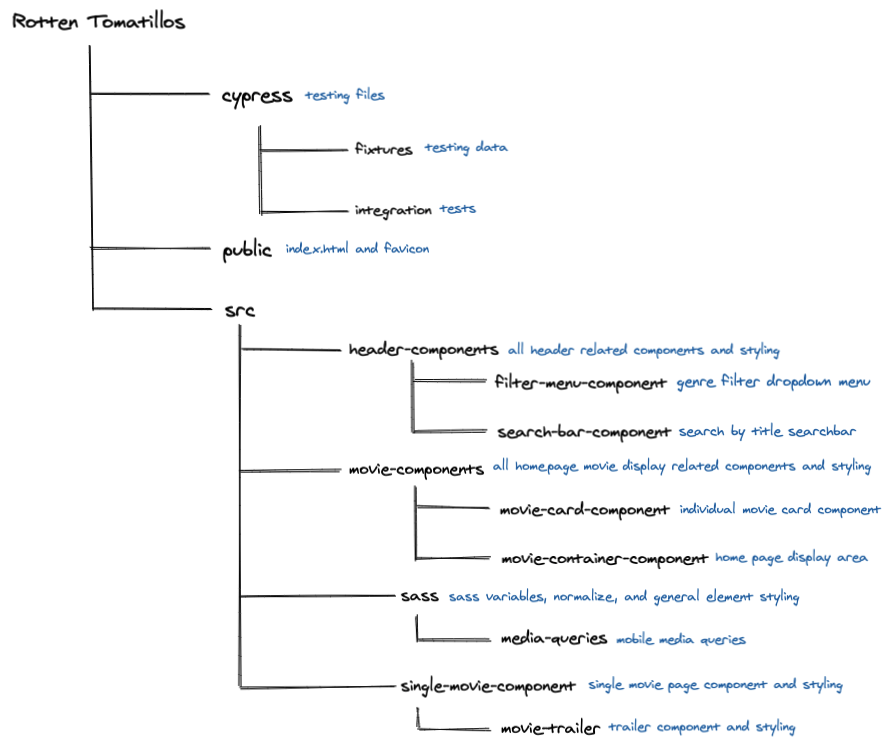

# Rotten Tomatillos - Movie Info
For this project, Jeff and I were given the prompt to create an informative movie website similar to Rotten Tomatoes, hence the name, Rotten Tomatillos. This is our first project using React, and any React related dependencies. The main scope of this project was to build a multi-page website that is: fetching information from an API, using React and React router, and doing end-to-end testing with cypress.

## Project Members
This project was designed and implemented by [Luke Mason](https://github.com/LukeMason33) and [Jeff Kersting](https://github.com/JeffKersting)

## Usage
Rotten Tomatillos is a website that allows users to browse a range of 40 different movies (all movies that are included in the given API), where each movie has it's own specific details. Users are able to view a movie's overall rating, summary, revenue, budget, runtime, as well as watch the official trailers for them which are pulled from YouTube.

Initially, when a user visits the site, they will be prompted to the main dashboard. No login necessary for this app!

Additionally, the user will be able to use the search bar located in the header of the screen to search for movies by title.

The user will also be able to filter the movies by genre!

When on the main page, the user can view these little cards for each movie. Each of the cards will include the title of the movie, the poster, the movie's genres, as well as the movie's rating. This is true for each movie that is included in our API data.

Movie Card:

A user is able to click on that red button on the bottom of each card that says "Details" to view more in-depth information about that particular movie. When clicked, the user will be prompted to another page that contains that information. Here a user can view info such as the movie's budget, revenue, run-time, summary, etc.

When on one of the movies' details pages, the user will be given two options on where to go from here. One consists of a "Home" button, that when clicked, will take the user back to the main dashboard where all movies are displayed. The other option consists of a trailer for the particular movie. When this button ic clicked, the user will be displayed the trailer which can be played from within our website.

The user is given two options from the trailer display, to either return back to the movie's details page, or just go right back to the main dashboard.

## How to Install
1. `fork` this repository
2. `git clone` it down to your command line
3. Navigate into the repository on your machine
4. Run `npm install`
5. Run `npm start` to launch local server

OR

Visit live site [here]() (we will build this live right?)

## Technologies Used
1. React
2. React Router
3. Asyncronous JavaScript
3. WebPack
4. Cypress
5. Sass/SCSS

## Planning
We utilized github projects for project management, that board can be found [here](https://github.com/LukeMason33/Rotten-Tomatillos/projects)  
The detailed spec for this project can be found [here](https://frontend.turing.io/projects/module-3/rancid-tomatillos-v3.html)  

### Testing development
The testing that we did for this application was all done through Cypress. At Turing, we have only been implementing unit tests to test our applications, but now that we are using React, we have been introduced to the Cypress testing library, where we tested each display of our site by writing end-to-end testing for both happy, and sad paths.

## Wins and Challenges

### Challenges

#### Cypress
The switch from unit testing to end-to-end testing presented interesting challenges. Implementing a new testing suite required some experimenting with the unique idiosyncrasies of Cypress. Properly implementing the use of fixtures and intercepts proved to be the most foreign and challenging concept encountered when learning to properly integrate end-to-end testing.

#### React and Planning
Planning the code architecture from the outset when developing with a new technology presented a challenge in the form of conceptualizing the code structure with a framework we had very little experience with. It required more in depth research and discussion than would normally be necessary in order to complete our rough draft of the architecture planning spec.

### Wins

#### Successful React Implementation
Once we dug into writing the code, and getting comfortable with some of the new concepts introduced with React, our project started moving forward very smoothly. We encountered very few issues or snags writing our code, and shared an enthusiasm for the usefulness and general quality of life improvements React offers. It was a watershed moment in our programming development when we were able to fully recognize the benefits that frameworks provide.

#### End-to-End Testing
After working through some of the initial hiccups of learning the Cypress testing suite, we were able to get comfortable and begin testing easily and effectively. Implementation of Cypress allowed us to fully conceptualize what the process of end-to-end testing entails, and underscored the importance of both unit testing as well as end-to-end testing. The use of a different testing systems brought the testing process as a whole into clearer focus.

## Future Iterations
* Adding some sort of login so that users can have a more personalized experience such as adding movies to a list of "Want to Watch", or/and have users be able to leave their own reviews and comments on movies.
* Another iteration is to just get more movies on the site to see how our current setup would handle fetching a lot more data than it currently does.
* Build an admin view to handle unnecessary comments from users, or to be able to add new movies to our server for the user to see/interact with.

## File Architecture

