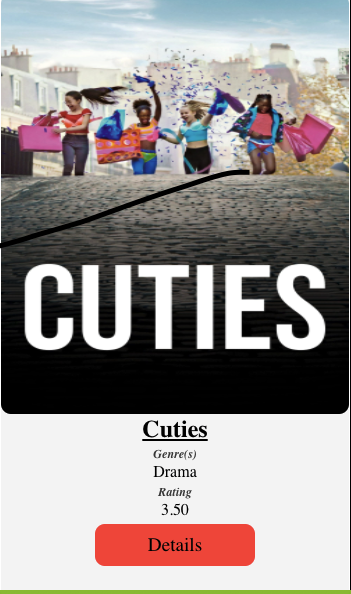

# Rotten Tomatillos - Movie Info
For this project, Jeff and I were given the prompt to create an informative movie website similar to Rotten Tomatoes, hence the name, Rotten Tomatillos. This is our first project using React, and any React related dependencies. The main scope of this project was to build a multi-page website that is: fetching information from an API, using React and React router, and doing end-to-end testing with cypress.

## Project Members
This project was designed and implemented by [Luke Mason](https://github.com/LukeMason33) and [Jeff Kersting](https://github.com/JeffKersting)

## Usage
The Rotten Tomatillos website is a site that allows users to browse a range of 40 different movies (all movies that are included in the given API) where each movie has it's own specific details. Users are able to view a movie's overall rating, summary, revenue, budget, runtime, as well as watch the official trailers for them which are pulled from YouTube.

Initially, when a user visits the site, they will be prompted to the main dashboard. No login necessary for this app!

Additionally, the user will be able to use the search bar located in the header of the screen to search for movies by title.

The user will also be able to filter the movies by genre!

When on the main page, the user can view these little cards for each movie. Each of the cards will include the title of the movie, the poster, the movie's genres, as well as the movie's rating. This is true for each movie that is included in our API data.

Movie Card:

A user is able to click on that red button on the bottom of each card that says "Details" to view more in-depth information about that particular movie. When clicked, the user will be prompted to another page that contains that information. Here a user can view info such as the movie's budget, revenue, run-time, summary, etc.

When on one of the movies' details pages, the user will be given two options on where to go from here. One consists of a "Home" button, that when clicked, will take the user back to the main dashboard where all movies are displayed. The other option consists of a trailer for the particular movie. When this button ic clicked, the user will be displayed the trailer which can be played from within our website.

The user is given two options from the trailer display, to either return back to the movie's details page, or just go right back to the main dashboard.

## How to Install
1. `fork` this repository
2. `git clone` it down to your command line
3. Navigate into the repository on your machine
4. Run `npm install`
5. Run `npm start` to launch local server

OR

Visit live site [here]() (we will build this live right?)

## Technologies Used
1. React
2. React Router
3. Asyncronous JavaScript
3. WebPack
4. Cypress
5. Sass/SCSS

## Planning
We utilized github projects for project management, that board can be found [here](https://github.com/LukeMason33/Rotten-Tomatillos/projects)  
The detailed spec for this project can be found [here](https://frontend.turing.io/projects/module-3/rancid-tomatillos-v3.html)  

### Testing development
The testing that we did for this application was all done through Cypress. At Turing, we have only been implementing unit tests to test our applications, but now that we are using React, we have been introduced to the Cypress testing library, where we tested each display of our site by writing end-to-end testing for both happy, and sad paths.

### Challenges
* This was our first experience receiving a large codebase we were unfamiliar with and needing to work on it. It was certainly a challenge to familiarize ourselves with what the code was doing and it was quite an undertaking to reorganize existing code to improve organization and functionality. Initially we struggled to find a good place to jump in and start refactoring, but eventually decided we should start by determining what within the codebase was already functioning well in terms of JavaScript functionality and User Experience/Interaction. After that, we were better able to plan out how to most efficiently move forward and use our time by dividing and conquering small tasks and communicating openly and frequently about new issues we found, or changes we would like to implement. We ended up having to separate our desired changes into `required` to dos and `desired` to dos (things that would be nice to implement but not our minimum viable product).
* We ran into some resistance when trying to access all info from our network requests simultaneously. After some research we found `Promise.all()` which solved our issues, as it returns all the input network requests together.
* Utilizing Sass/SCSS for the first time was interesting. It took some additional research on syntax and functionality of mixins vs built in color functions. The biggest challenge here was taking messy provided CSS and converting it into SCSS while refactoring and adjusting styling to improve UX.
* Understanding WebPack - It was our first experience with WebPack so we had to do some research and fiddling to get it to work as we expected/wanted it to.

### Wins
* Developing a strong understanding of a foreign codebase and being able to refactor significantly. While this was also one of our major challenges during the project, we were all very proud of our ability to quickly familiarize ourselves with the functionality and therefore refactor effectively.
* Teamwork and dividing up work successfully without any major merge conflicts. We chose to implement a divide and conquer workflow, and because of our clear and frequent communication, we were extremely successful in getting tasks done more quickly. We also took the time to walk through all the changes together to be sure we fully understood all the changes.

## Future Iterations
* Adding Recipes: A user would be able to submit a recipe to the site, and after admin review, it could be approved and added to the recipe database.
* Admin view: Developing an Admin view for the site that could show some User trends and any submitted recipes waiting for review.
* Rating Recipes: After a user has made a recipe they should be prompted to rate the recipe on a few different qualities (maybe difficulty level and approval). These ratings could then be visible to other users.
* Providing the cost of the missing ingredients in order to make a recipe.
* The button to remove items from pantry to only work if conditions are met where the user has enough of each ingredient to make the recipe.
